## CYBORG (TryHackMe)

### Enumeración de puertos

Empezamos esta máquina de Tryhackme con un escaneo de puertos abiertos y versiones con nmap.

Nmap nos muestra dos puertos abiertos, el 22 SSH y el 80 EL HTTP.

```jsx
Nmap 7.94SVN scan initiated Mon Dec 16 13:32:38 2024 as: /usr/lib/nmap/nmap -p- --open -sVC --min-rate 3000 -n -Pn -oN escaneo.txt 10.10.77.14
Nmap scan report for 10.10.77.14
Host is up (0.058s latency).
Not shown: 65533 closed tcp ports (reset)
PORT STATE SERVICE VERSION
22/tcp open ssh OpenSSH 7.2p2 Ubuntu 4ubuntu2.10 (Ubuntu Linux; protocol 2.0)
| ssh-hostkey:
| 2048 db:b2:70:f3:07:ac:32:00:3f:81:b8:d0:3a:89:f3:65 (RSA)
| 256 68:e6:85:2f:69:65:5b:e7:c6:31:2c:8e:41:67:d7:ba (ECDSA)
|_ 256 56:2c:79:92:ca:23:c3:91:49:35:fa:dd:69:7c:ca:ab (ED25519)
80/tcp open http Apache httpd 2.4.18 ((Ubuntu))
|_http-title: Apache2 Ubuntu Default Page: It works
|_http-server-header: Apache/2.4.18 (Ubuntu)
Service Info: OS: Linux; CPE: cpe:/o:linux:linux_kernel
Service detection performed. Please report any incorrect results at https://nmap.org/submit/ .
Nmap done at Mon Dec 16 13:33:06 2024 -- 1 IP address (1 host up) scanned in 27.66 seconds
```

---

### Enumeración web

Nos dirigimos al navegador para ver que nos muestra en el puerto 80.

Solo vemos una página por defecto de apache.

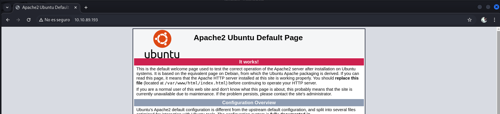

Dado que la web no nos ofrece nada, haremos un poco de fuzzing para ver si existen directorios ocultos que nos puedan ofrecer alguna pista.

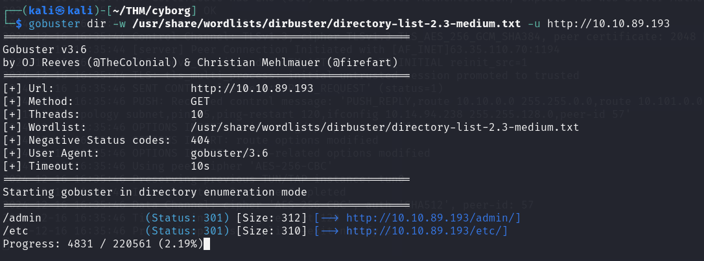

Gobuster nos descubre dos directorios ocultos llamados /admin y /etc, les echaremos un vistazo para ver si nos ofrecen algo interesante.

El directorio /admin no descubre una web que parece ser de músicos.

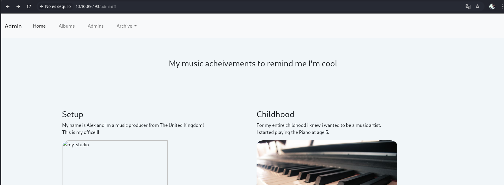

En el reconocimiento de la web, descubrimos lo que parece ser un servicio de mensajería que ya nos explica que existen problemas de seguridad, y nos da tres potenciales usuarios, Alex, Josh y Adam.

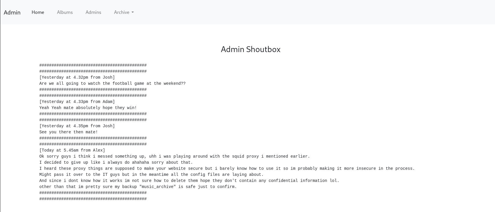

Cuando nos dirigimos al menú Archive, en el submenú descargas nos descarga un archivo llamado archive.tar, lo descomprimimos.

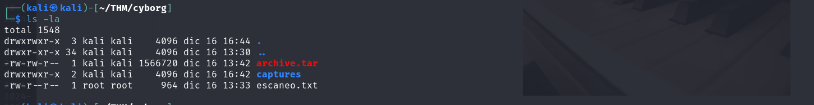

Nos muestra un directorio llamado home, parece ser un backup. lo guardaremos y seguiremos con el otro directorio que encontramos llamado /etc.

### Análisis de los archivos de `/etc`

El navegador nos muestra un directorio donde existe un archivo de configuración y un password!!

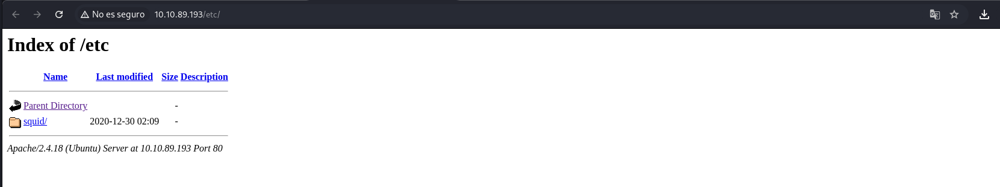

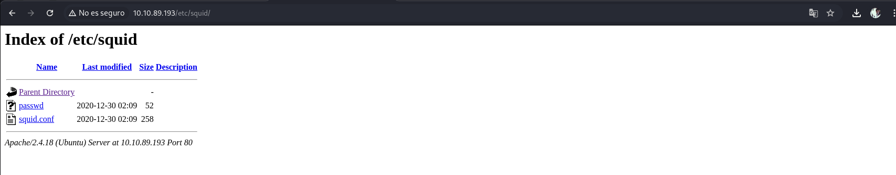

Abrimos el archivo password y nos encontramos una contraseña hasheada del archivo de música de Alex, music_archive, que mencionaba en la web.

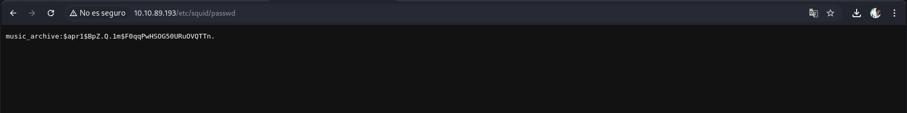

Para deshashear la contraseña usaremos Hash id para saber que tipo de hash se trata.

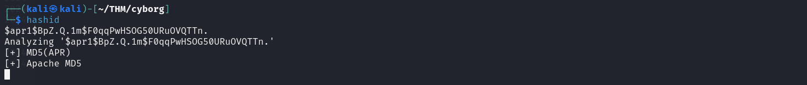

La herramienta nos descubre el hash así que lo guardamos en un archivo e intentaremos deshashearlo con John.

`john --format=md5crypt-long --wordlist=/usr/share/wordlists/rockyou.txt hash.txt`

---

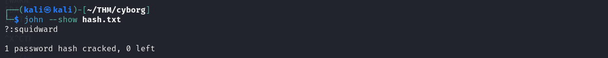

Tenemos una contraseña para el archivo music_archive pero no tenemos el archivo en cuestión, así que, guardaremos la contraseña e investigaremos más sobre el directorio home que descargamos y descomprimimos anteriormente.

### Extracción de la copia de seguridad

Entramos en algunos directorios hasta que en directorio final nos encontramos algunos archivos, entre ellos uno llamado README así que le echamos un vistazo, como ya sabíamos se trata de un backup, en este caso un repositorio de Borg y nos invita a visitar su página para saber cómo funciona.

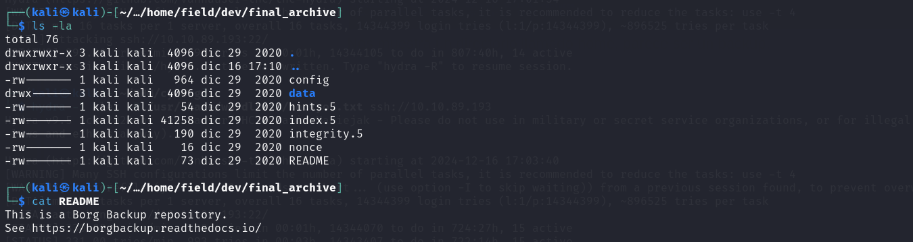

Después de averiguar cómo funciona Borg e instalarlo en nuestro equipo vamos a extraer el contenido music_archive con el comando extract.

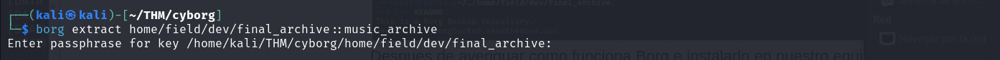

Usamos la contraseña que averiguamos con John y nos apareció un directorio en Home llamado Alex.

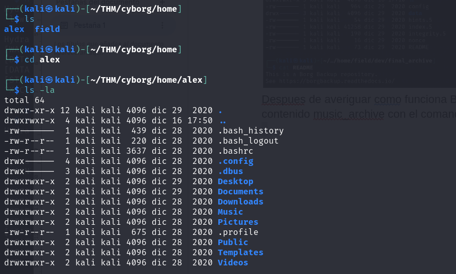

Después de explorar entre directorios nos encontramos una nota donde aparecen credenciales de Alex.

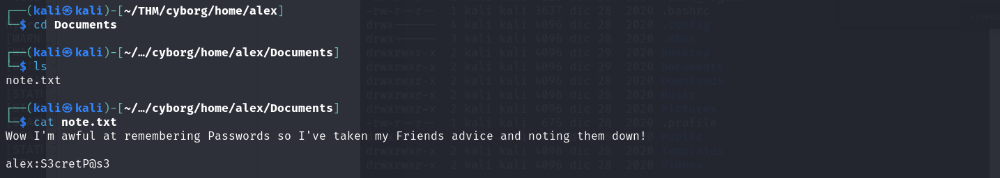

### Acceso inicial por SSH

Probamos a conectarnos por SSH y funciona, allí podemos encontrar la bandera de usuario.

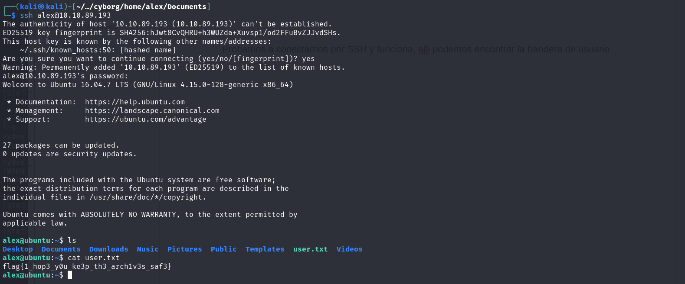

Ahora somos el usuario Alex así que tendremos que escalar privilegios para convertirnos en root.

### Escalada de privilegios

El comando `sudo -l` nos dice que podemos ejecutar el comando backup.sh como root.

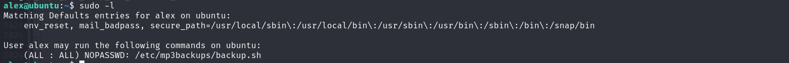

Vamos a analizar el script backup.sh para ver que hace e investigar si nos puede servir de ayuda.

El script busca archivos mp3 y los guarda comprimidos en unas rutas específicas pero tiene una parte interesante al final que nos permite ejecutar un comando.

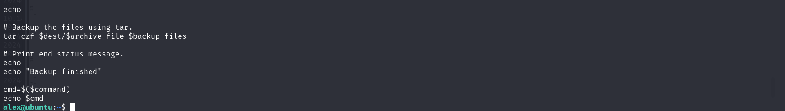

Ejecutaremos el comando iniciando una shell en bash, y nos convertiremos en root.

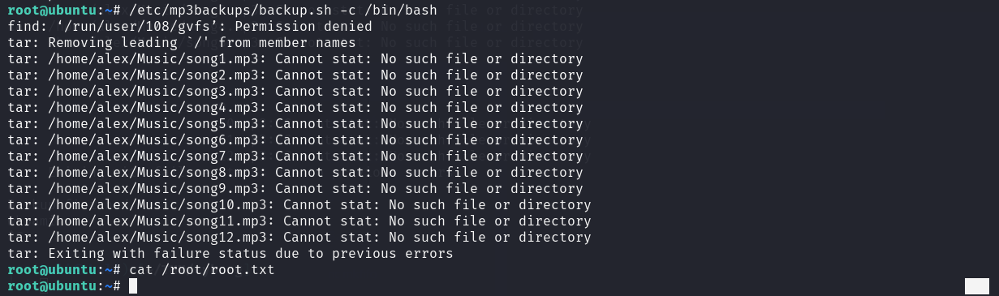

El comando funciona y automáticamente nos convertimos en root, pero no nos responde a los comandos así que probaremos una reverse shell para ver si así podemos acceder sin restricciones.

Ponemos netcat en escucha al puerto 4444.

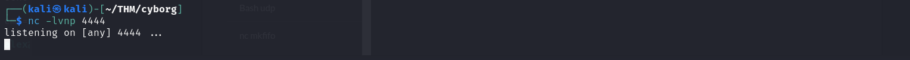

y mandamos la reverse shell.

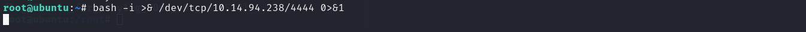

Ya recibimos la shell como root y podemos leer la flag sin problemas.

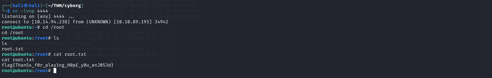
