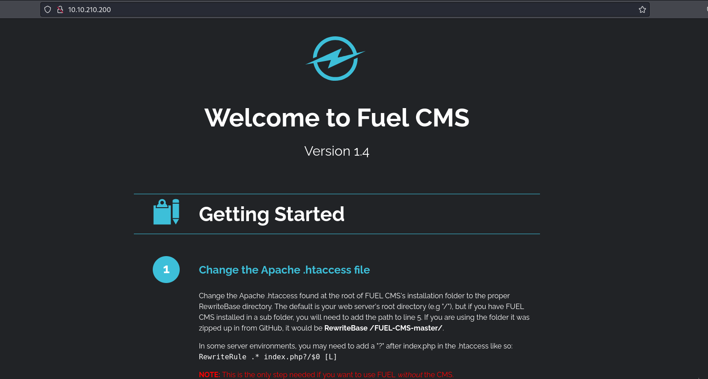
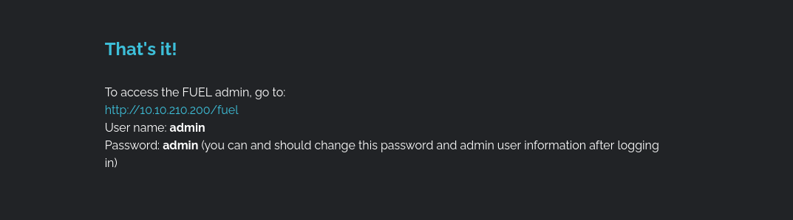
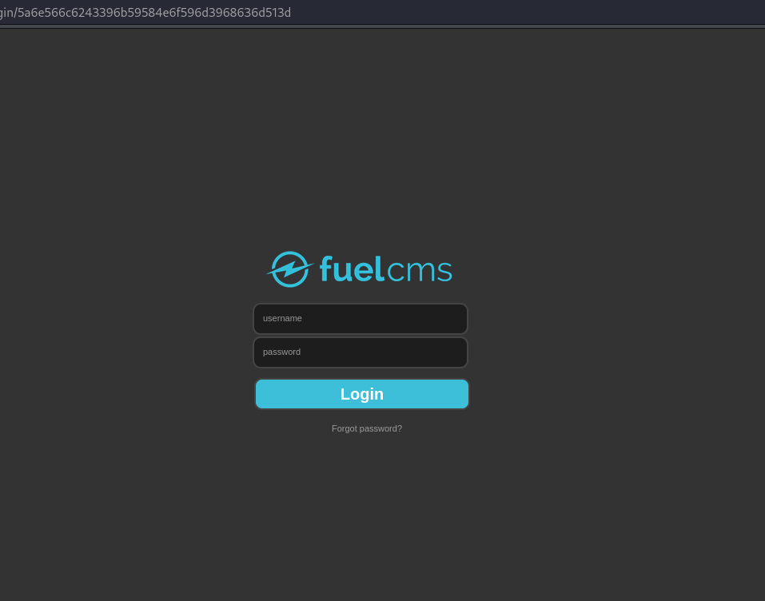
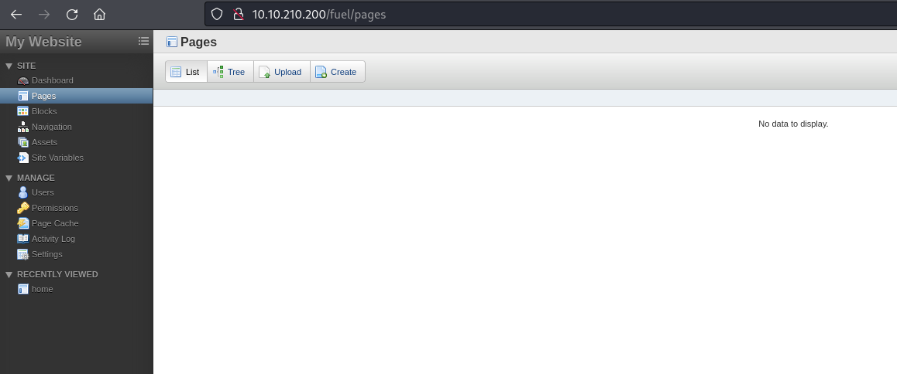
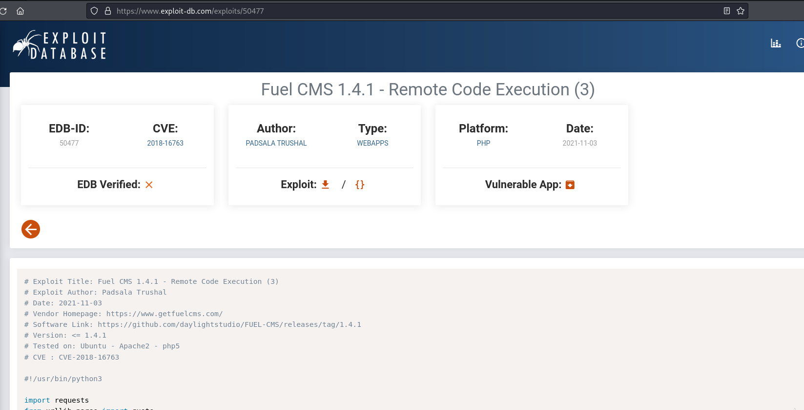
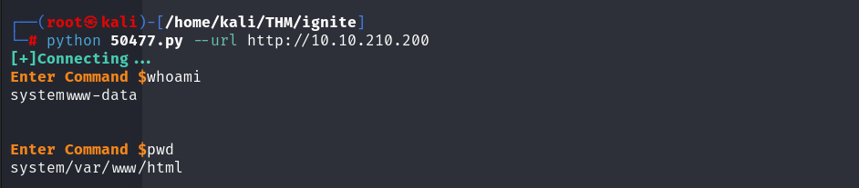
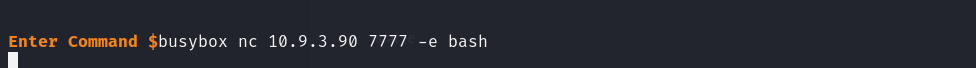
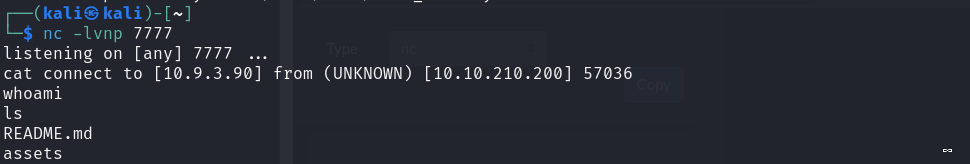
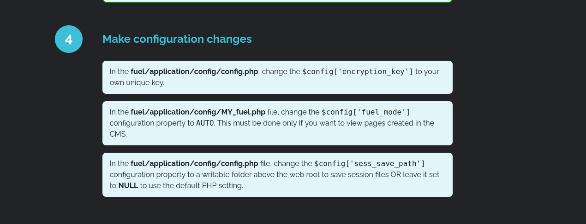
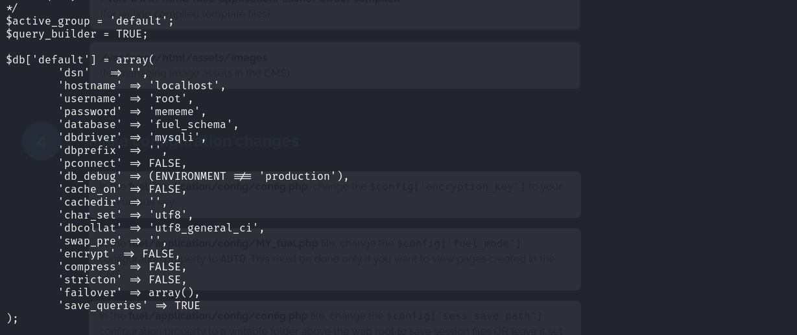

# Ignite (Tryhackme)


### Reconocimiento

### Nmap

Empezamos el reconocimiento de puertos utilizando nmap.

```jsx
┌──(root㉿kali)-[/home/kali/THM/ignite]
└─# nmap -p- --open -sVC --min-rate 3000 -n -Pn 10.10.210.200
Starting Nmap 7.94SVN ( https://nmap.org ) at 2024-11-26 05:44 EST
Nmap scan report for 10.10.210.200
Host is up (0.065s latency).
Not shown: 65246 closed tcp ports (reset), 288 filtered tcp ports (no-response)
Some closed ports may be reported as filtered due to --defeat-rst-ratelimit
PORT STATE SERVICE VERSION
80/tcp open http Apache httpd 2.4.18 ((Ubuntu))
| http-robots.txt: 1 disallowed entry
|_/fuel/
|_http-title: Welcome to FUEL CMS
|_http-server-header: Apache/2.4.18 (Ubuntu)
Service detection performed. Please report any incorrect results at https://nmap.org/submit/ .
Nmap done: 1 IP address (1 host up) scanned in 33.04 seconds
```

---

Solo nos muestra el puerto 80 HTTP abierto, el título es Welcome to FUEL CMS, y corre una versión de Apache httpd 2.4.18.

### Búsqueda de vulnerabilidades

Nos iremos al navegador a buscar más información.



Nos encontramos una página principal de Fuel CMS, es un sistema de gestión de contenido en php, con interfaz gráfica intuitiva.

Esta misma página principal nos da la manera de acceder al panel de login y cuales son las credenciales por defecto.





Nos logueamos con las credenciales por defecto y accedemos al panel de control.



Una vez dentro, intentamos subir varias páginas nuevas para cargar un reverse shell pero nada nos llega a cargar, así que como tenemos la versión de Fuel buscaremos en internet alguna vulnerabilidad.

Exploits-db nos da información sobre una vulnerabilidad en Fuel version 1.4.1 que nos permite ejecución de código CVE-2018-16763 y nos da un exploit en Python.



### Acceso inicial

Descargamos el exploit y nos informamos de como funciona, solo tenemos que poner la url para que funcione, y así es, podemos escribir comandos y el script nos devuelve la respuesta.



Cómo ejecutar comandos, intentaremos ejecutar una reverse shell para acceder a la máquina directamente.



La reverse nos llega y después del tratamiento de la tty ya podemos movernos libremente por el servidor.



Nos vamos al directorio de www-data y allí estará nuestra primera flag.

Probamos la escalada de privilegios por binarios pero no encontramos nada útil.

### Escalada de privilegios

Recordamos que en la página principal de Fuel nos explica donde se guardaban los archivos de configuración de la app.



Nos dirigimos al archivo de configuración y encontramos un database.php que nos parece interesante. Allí encontramos las credenciales de root.



Con las credenciales ya podemos convertirnos en root y leer la flag. 

/image6.png)
