# Library (TryHackme)

### Reconocimiento

### Nmap

Empezamos esta máquina vulnerable nivel Easy de Tryhackme con un escaneo de puertos abiertos y versiones con nmap.

```bash
──(root㉿kali)-[/home/kali/THM/library]

└─# nmap -p- --open -sVC --min-rate 3000 -n -Pn 10.10.208.114

Starting Nmap 7.94SVN ( https://nmap.org ) at 2024-11-25 18:32 EST

Nmap scan report for 10.10.208.114

Host is up (0.077s latency).

Not shown: 65368 closed tcp ports (reset), 165 filtered tcp ports (no-response)

Some closed ports may be reported as filtered due to --defeat-rst-ratelimit

PORT STATE SERVICE VERSION

22/tcp open ssh OpenSSH 7.2p2 Ubuntu 4ubuntu2.8 (Ubuntu Linux; protocol 2.0)

| ssh-hostkey:

| 2048 c4:2f:c3:47:67:06:32:04:ef:92:91:8e:05:87:d5:dc (RSA)

| 256 68:92:13:ec:94:79:dc:bb:77:02:da:99:bf:b6:9d:b0 (ECDSA)

|_ 256 43:e8:24:fc:d8:b8:d3:aa:c2:48:08:97:51:dc:5b:7d (ED25519)

80/tcp open http Apache httpd 2.4.18 ((Ubuntu))

|_http-title: Welcome to Blog - Library Machine

| http-robots.txt: 1 disallowed entry

|_/

|_http-server-header: Apache/2.4.18 (Ubuntu)

Service Info: OS: Linux; CPE: cpe:/o:linux:linux_kernel

Service detection performed. Please report any incorrect results at https://nmap.org/submit/ .

Nmap done: 1 IP address (1 host up) scanned in 26.78 seconds

```
Nmap nos muestra dos puertos abiertos; el 22 donde corre un protocolo SSH y el 80 el HTTP donde se aloja un Apache/2.4.18 (Ubuntu) con una web llamada Welcome to Blog - Library Machine. Le echaremos un vistazo.ç

### Reconocimiento web

La web es un blog en el cual podemos ver posts del propietario, además es posible hacer comentarios, tiene una panel para hacerlos.

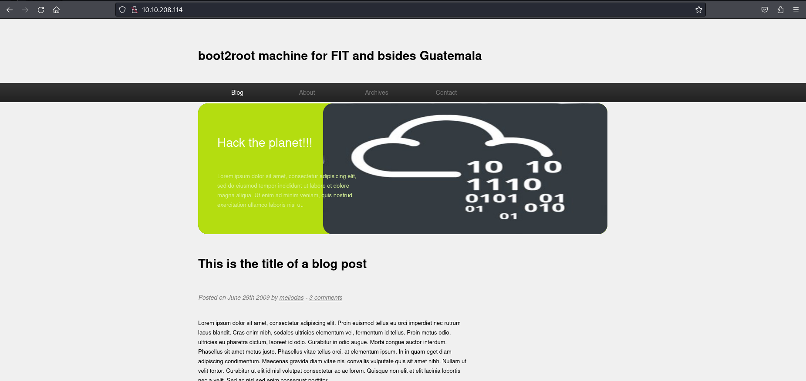

hay diversos comentarios de usuario root, www-data y un Anonymous, todo es en texto de relleno así que vamos a probar de hacer uno a ver que pasa.

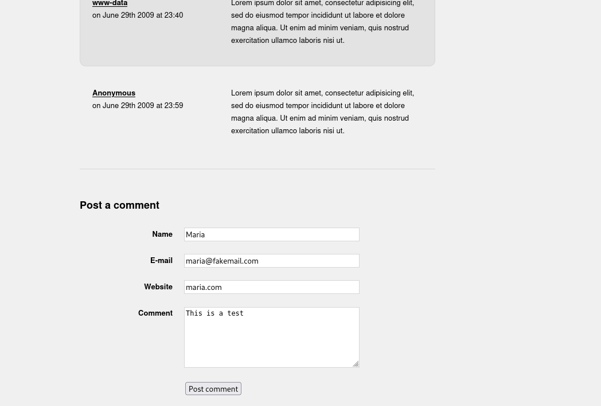


Cuando enviamos el comentario, el comentario se envía pero no se añade a los comentarios de la web, así que nada ocurre, no sabemos donde fue nuestro comentario así que probaremos hacer un poco de fuzzing para encontrar directorios ocultos ya que las secciones del blog no nos llevan a ningún sitio.

### Gobuster

Gobuster nos muestra un directorio llamado /images , nos lleva a un lugar donde se almacenan imágenes de la web pero tampoco sirve de mucha ayuda porque no hay ningún sitio donde poder cargarlas.

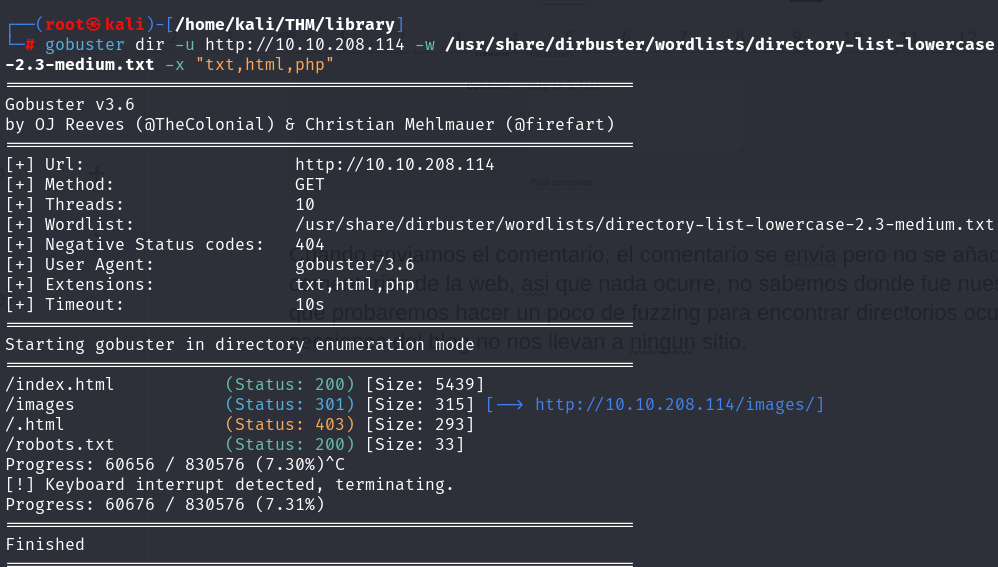

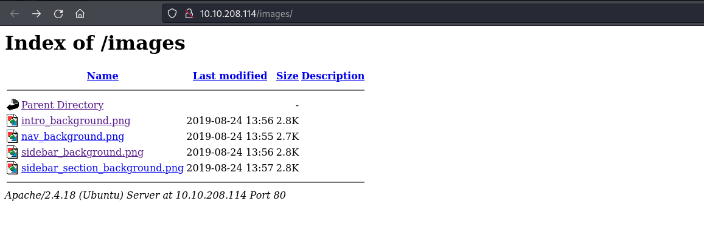


También vemos que existe un archivo robots.txt, el cual nos menciona el diccionario rockyou.

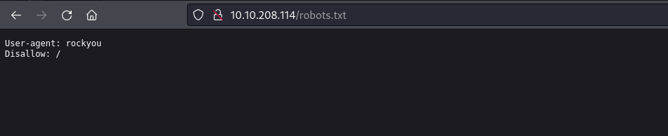


No estamos encontrando nada con Gobuster, asi que volvemos a la web, fijándonos bien encontramos un potencial usuario llamado meliodas, está a cargo del blog, como nos dio la pista del Rockyou probaremos fuerza bruta con ese usuario al puerto SSH.

### Explotación

## Hydra

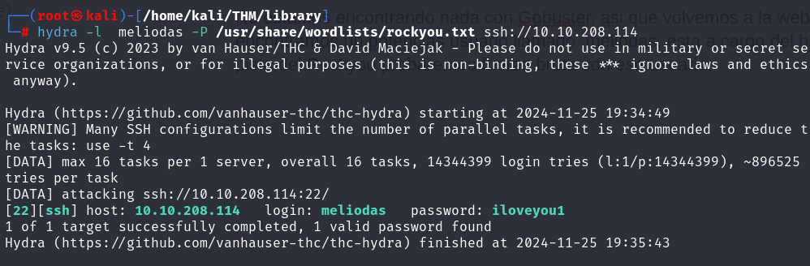


Ya tenemos un password y nos podemos conectar por SSH allí encontramos la flag de usuario.

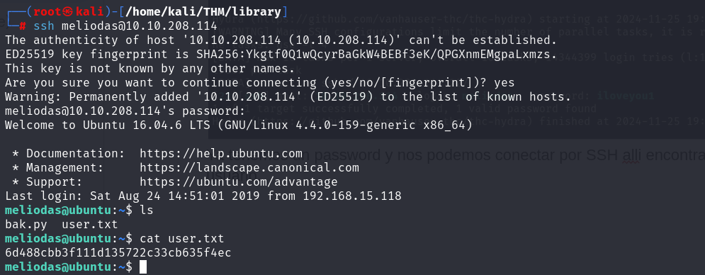


### Post-explotación (Escalada)

Para escalar privilegios y convertirnos en root primero utilizaremos el comando sudo -l para ver si nuestro usuario meliodas tiene algún privilegio.

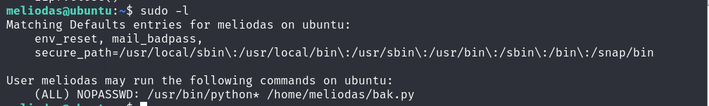


Meliodas puede ejecutar el comando bak.py como root, es el script que nos encontramos en el directorio de su usuario.

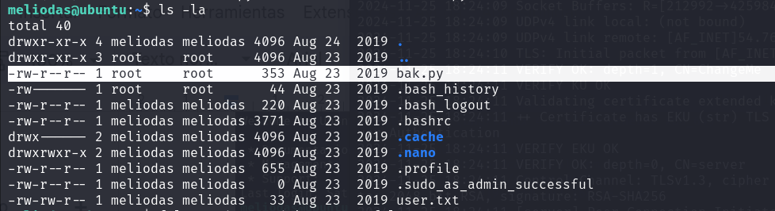


Como no tenemos permiso para escribir en él quizás podemos borrarlo y volver a escribirlo para escalar privilegios.

Borramos el script.

Después crearemos un script nuevo con el mismo nombre que nos abra una shell en bash como root.

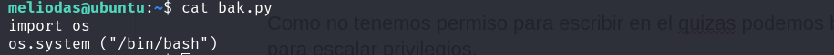


Y finalmente ejecutaremos el script con nuestra ruta del binario como root.

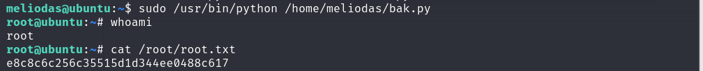


Ya somos root y ya tenemos nuestra última flag!.


