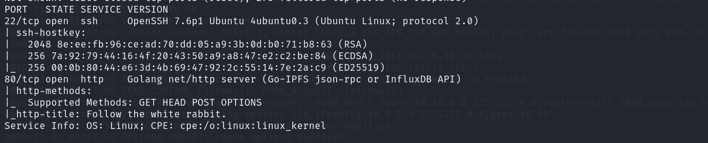
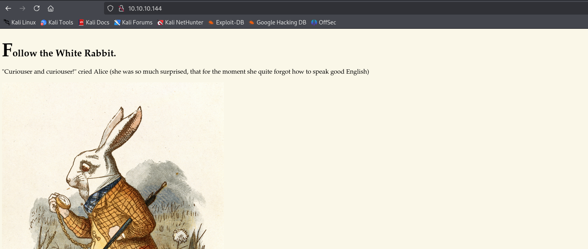
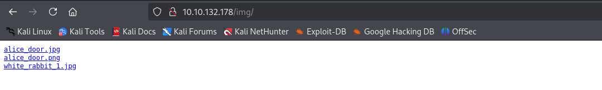

# EXPLOTACIÓN DE LA MÁQUINA WONDERLAND (THM)

Wonderland es una máquina de Try hack me de nivel medio, para explotarla hemos usado técnicas como:

- Fuzzing de directorios ocultos.
- Python Library Hijacking.
- Descompilación de binarios y análisis con Ghidra.
- Manipulación del PATH.
- Escalada de privilegios con uso de capabilities.

Después de montar el laboratorio y conectarnos por VPN empezaremos su explotación.

## Escaneo de puertos (Nmap)

Empezamos la fase de reconocimiento de puertos con nmap.

Nmap nos reporta dos puertos abiertos, el 22 (SSH) y el http (HTTP).

## Análisis web

Para ver que se encuentra el puerto http iremos al navegador, según nmap se aloja una página titulada Follow the rabbit.

Analizamos los recursos de la página y encontramos un directorio llamado /img que es donde se almacenan las imágenes de la web.

