# EXPLOTACIÓN DE LA MÁQUINA WONDERLAND (THM)

Wonderland es una máquina de Try hack me de nivel medio, para explotarla hemos usado técnicas como:

- Fuzzing de directorios ocultos.
- Python Library Hijacking.
- Descompilación de binarios y análisis con Ghidra.
- Manipulación del PATH.
- Escalada de privilegios con uso de capabilities.

Después de montar el laboratorio y conectarnos por VPN empezaremos su explotación.

## Escaneo de puertos (Nmap)

Empezamos la fase de reconocimiento de puertos con nmap.

Nmap nos reporta dos puertos abiertos, el 22 (SSH) y el http (HTTP).

## Análisis web

Para ver que se encuentra el puerto http iremos al navegador, según nmap se aloja una página titulada Follow the rabbit.

Analizamos los recursos de la página y encontramos un directorio llamado /img que es donde se almacenan las imágenes de la web.

## Fuzzing de directorios

Como vemos que existen otras imágenes que aún no hemos encontrado, haremos una búsqueda de directorios ocultos (fuzzing) para ver que podemos encontrar.

Usamos Gobuster y nos encuentra el directorio /img que ya sabíamos y un directorio llamado /r/.

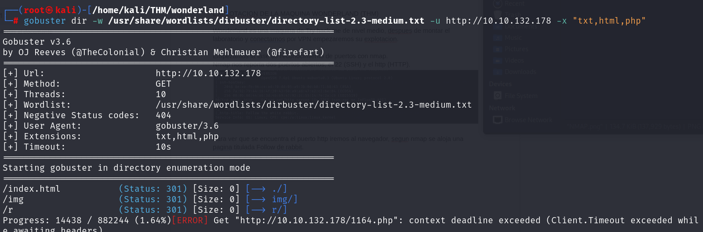

Nos dirigimos al navegador para ver que hay y nos encontramos una página con un mensaje.

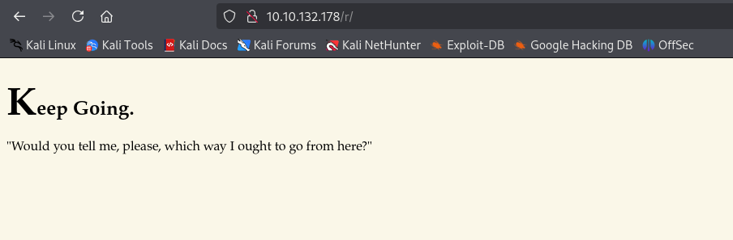

La página nos dice que continuemos adelante, parece ser una pista, quizás lo que quiere es que sigamos buscando directorios, volveremos a hacer fuzzing pero esta vez con dirb, que nos muestra otro directorio llamado /a.
Una vez más nos dice que continuemos, seguimos buscando directorios y navegando por páginas que nos invitan a continuar buscando. Las páginas siguen una conversación entre alice y el gato. y los directorios siguen un patrón, todos ellos forman la palabra /r/a/b/b/i/t/
Por fin llegamos al último. ¡La puerta para entrar en wonderland!

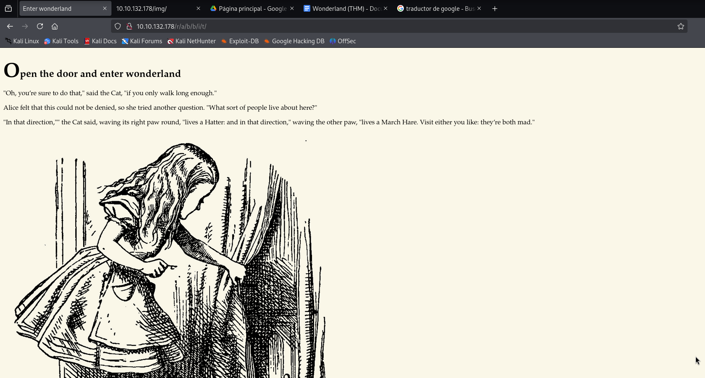

Si la web dice que es la puerta de entrada debe ser porque algo esconde, miramos los recursos de la página y encontramos la contraseña de Alice.

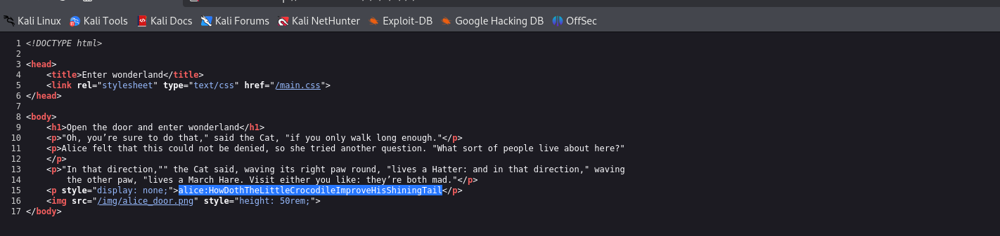

## Alice (SSH)

Intentaremos conectarnos por SSH con esas credenciales. Funciona

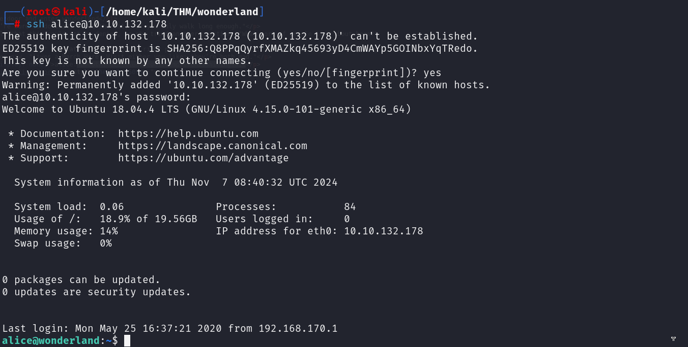

En la máquina somos Alice y estamos en su directorio, cuando listamos sus archivos vemos que existe un archivo root.txt al que no tenemos acceso, de momento ni rastro de la flag de usuario.

En su directorio hay un script en python llamado walrus_and_the_carpenter.py, le echamos un vistazo y vemos que se trata de una poema, el script lo que hace es coger una línea aleatoria del poema y la muestra en pantalla.

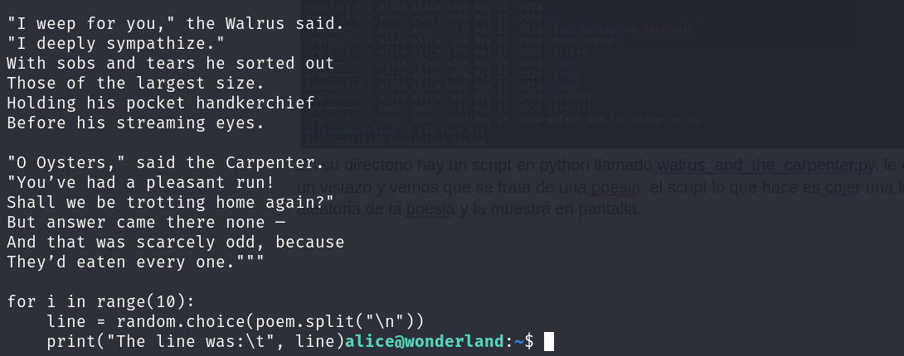

## Escalada de privilegios (Alice/Rabbit)

Ahora usaremos el comando sudo -l para ver qué privilegios tiene nuestro usuario Alice.

Nuestro usuario puede ejecutar el comando /usr/bin/python3.6 /home/alice/walrus_and_the_carpenter.py como usuario rabbit.

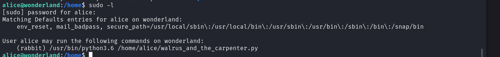

### Python Library Hijacking

Informándonos sobre el tema hemos encontrado una técnica llamada Python Library Hijacking que es el secuestro de una biblioteca de python se trata de manipular o suplantar una biblioteca o módulo para que puedas ejecutar comandos en el sistema a través de un script, como nosotros podemos ejecutar el script como rabbit nos servirá.

https://bypasseados.com/posts/python-library-hijacking-linux/

Lo primero es mirar los permisos que tenemos con el script, solo tenemos permisos de lectura así que no podremos manipular el script, lo siguiente será ver el orden de prioridad en PATH de Python para ello usaremos el comando;

`python3 -c 'import sys; print(sys.path)'`

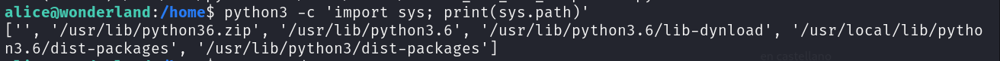

Lo que nos muestra es que el primer directorio donde buscará el módulo será el directorio de trabajo actual, por tanto si creamos un random.py a la hora de buscar la librería, el script encontrará el nuestro primero y lo importara. Este archivo contendrá un script que nos abrirá una shell como rabbit.

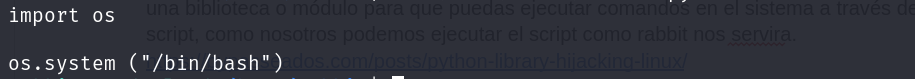

Ejecutamos el comando, y ya somos rabbit.

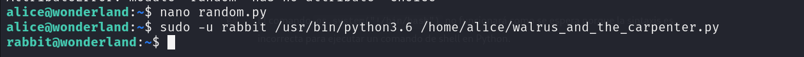

## Escalada de privilegios (Rabbit/Hatter)

Una vez como usuario rabbit nos dirigimos a su directorio y encontramos un archivo llamado teaParty, usamos file para saber de qué tipo de archivo se trata.

Se trata de un binario ELF con atributos setuid que permiten que el programa se ejecute con los privilegios del propietario, esto es interesante pq puede significar que podamos escalar privilegios con el. Ejecutamos el archivo y nos aparece un mensaje que nos dice que Mad hatter estará aquí pronto y nos indica una hora y dia,cuando pulsamos enter nos devuelve un error de segmentación.

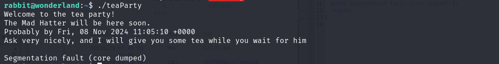

### Análisis con Ghidra

Como el programa nos parece una herramienta interesante para la escalada de privilegios nos la llevaremos a nuestra máquina para realizar un análisis más exhaustivo con Ghydra, Ghydra es un programa para analizar binarios y descompilarlos para entender cómo funcionan.

Cargamos el archivo en el programa y lo abrimos con Code Browser, nos dirigimos a la función main y analizamos con el decompiler.

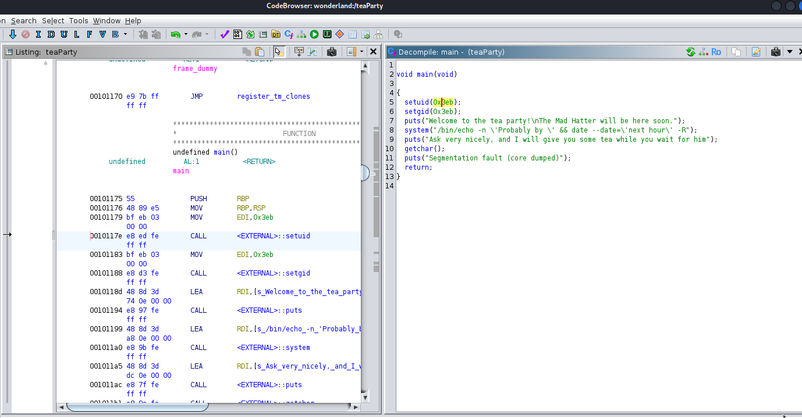

